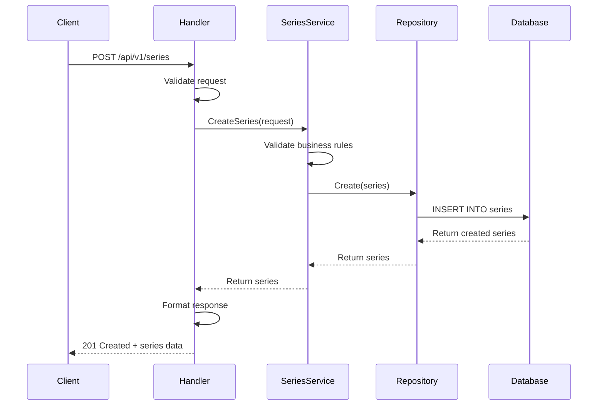
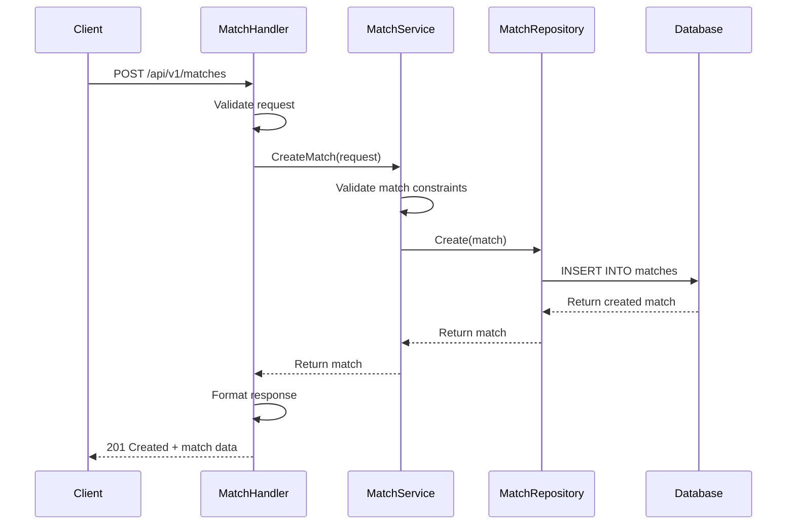
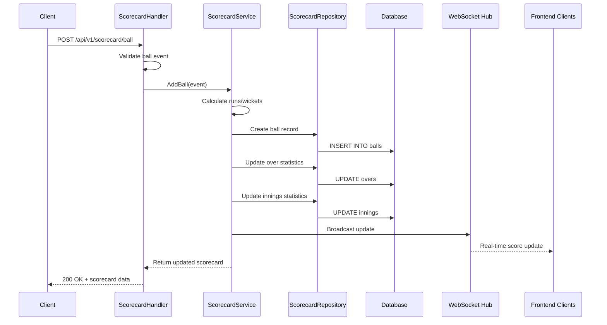
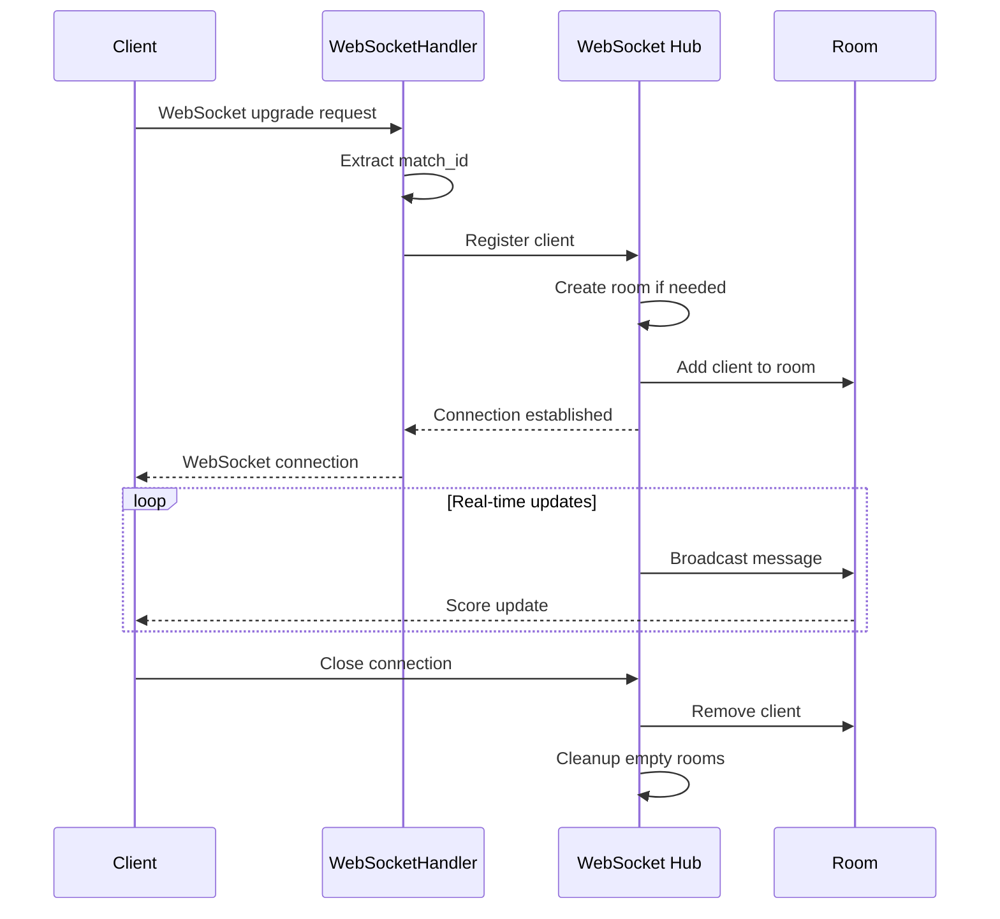
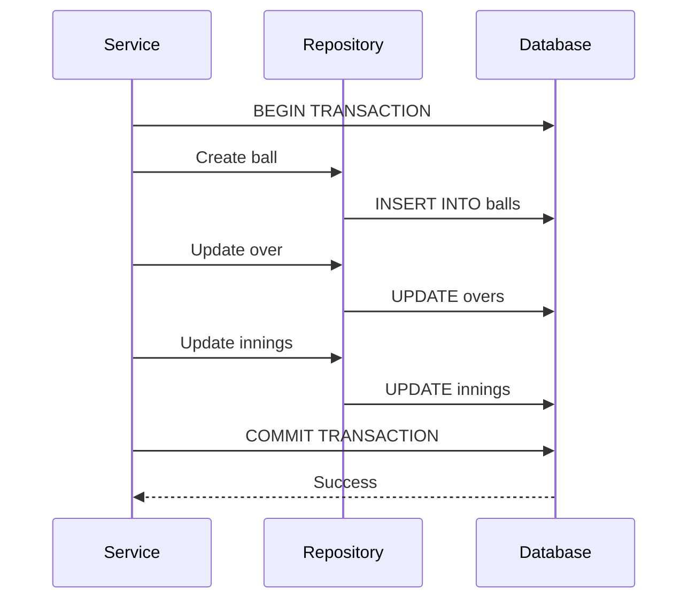
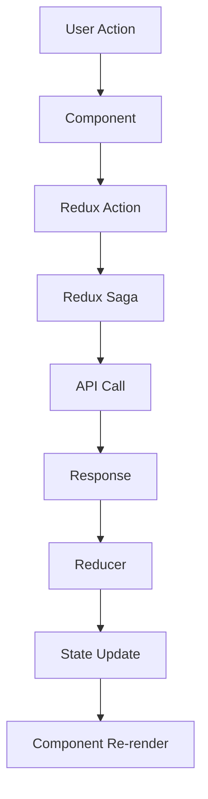

# 🏏 Spark Park Cricket

[](https://github.com/luffybhaagi/spark-park-cricket/actions/workflows/backend-ci.yml)
[](https://github.com/luffybhaagi/spark-park-cricket/actions/workflows/frontend-ci.yml)
[](https://golang.org/)
[](https://nodejs.org/)
[](https://nextjs.org/)
[]()

A comprehensive cricket tournament management system with real-time scoring capabilities, built with Go backend and Next.js frontend.

## 📋 Table of Contents

- [Overview](#overview)
- [Architecture](#architecture)
- [Backend Architecture](#backend-architecture)
- [Database Schema](#database-schema)
- [API Documentation](#api-documentation)
- [Sequence Flows](#sequence-flows)
- [Frontend Architecture](#frontend-architecture)
- [Getting Started](#getting-started)
- [Testing](#testing)
- [Deployment](#deployment)
- [Contributing](#contributing)

## 🎯 Overview

Spark Park Cricket is a full-stack cricket tournament management system that provides:

- **Series Management**: Create and manage cricket tournaments/competitions
- **Match Management**: Schedule matches with toss functionality and team configurations
- **Live Scoring**: Real-time ball-by-ball scoring with WebSocket updates
- **Scorecard System**: Comprehensive innings, overs, and balls tracking
- **Team Management**: Flexible team configurations (1-11 players per team)
- **Real-time Updates**: Live scoreboard updates via WebSocket connections

## 🏗️ Architecture

### System Overview

```
┌─────────────────┐    ┌─────────────────┐    ┌─────────────────┐
│   Frontend      │    │   Backend       │    │   Database      │
│   (Next.js)     │◄──►│   (Go)          │◄──►│   (Supabase)    │
│                 │    │                 │    │   (PostgreSQL)  │
└─────────────────┘    └─────────────────┘    └─────────────────┘
         │                       │
         │              ┌─────────────────┐
         │              │   WebSocket     │
         └──────────────►│   Hub           │
                        │   (Real-time)   │
                        └─────────────────┘
```

## 🔧 Backend Architecture

### Clean Architecture Pattern

The backend follows Clean Architecture principles with clear separation of concerns:

```
backend/
├── cmd/                    # Application entry points
│   ├── server/            # Main server application
│   ├── migrate/           # Database migration tool
│   └── test-runner/       # Test execution utility
├── internal/              # Private application code
│   ├── config/           # Configuration management
│   ├── database/         # Database client and migrations
│   ├── handlers/         # HTTP request handlers
│   │   ├── middleware/   # Custom middleware
│   │   └── routes.go     # Route definitions
│   ├── models/           # Domain models and DTOs
│   ├── repository/       # Data access layer
│   │   ├── interfaces/   # Repository contracts
│   │   └── supabase/     # Supabase implementations
│   ├── services/         # Business logic layer
│   └── utils/            # Utility functions
├── pkg/                  # Public packages
│   ├── events/           # Event broadcasting
│   └── websocket/        # WebSocket hub implementation
└── tests/                # Test suites
    ├── unit/             # Unit tests
    ├── integration/      # Integration tests
    └── e2e/              # End-to-end tests
```

### Layer Responsibilities

#### 1. **Handlers Layer** (`internal/handlers/`)

- HTTP request/response handling
- Input validation and sanitization
- Response formatting
- Error handling

#### 2. **Services Layer** (`internal/services/`)

- Business logic implementation
- Domain rule enforcement
- Cross-cutting concerns (logging, metrics)
- Event broadcasting

#### 3. **Repository Layer** (`internal/repository/`)

- Data access abstraction
- Database operations
- Query optimization
- Data mapping

#### 4. **Models Layer** (`internal/models/`)

- Domain entities
- Data transfer objects (DTOs)
- Validation rules
- Business constraints

### Service Container

The application uses a service container pattern for dependency injection:

```go
type Container struct {
    Series      *SeriesService
    Match       *MatchService
    Scorecard   *ScorecardService
    Hub         *websocket.Hub
    Broadcaster *events.EventBroadcaster
}
```

### Middleware Stack

Comprehensive middleware stack for security, monitoring, and request handling:

```go
r.Use(middleware.RecoveryMiddleware)      // Panic recovery
r.Use(middleware.LoggerMiddleware)        // Request logging
r.Use(middleware.RequestIDMiddleware)     // Request tracing
r.Use(middleware.TimeoutMiddleware)       // Request timeout
r.Use(middleware.SecurityMiddleware)      // Security headers
r.Use(middleware.ValidationMiddleware)    // Input validation
r.Use(middleware.MetricsMiddleware)       // Performance metrics
r.Use(middleware.RateLimitMiddleware)     // Rate limiting
r.Use(corsMiddleware())                   // CORS handling
```

## 🗄️ Database Schema

### Core Entities

#### Series

```sql
CREATE TABLE series (
    id UUID PRIMARY KEY DEFAULT uuid_generate_v4(),
    name VARCHAR(255) NOT NULL,
    start_date TIMESTAMP WITH TIME ZONE NOT NULL,
    end_date TIMESTAMP WITH TIME ZONE NOT NULL,
    created_at TIMESTAMP WITH TIME ZONE DEFAULT NOW(),
    updated_at TIMESTAMP WITH TIME ZONE DEFAULT NOW()
);
```

#### Matches

```sql
CREATE TABLE matches (
    id UUID PRIMARY KEY DEFAULT uuid_generate_v4(),
    series_id UUID REFERENCES series(id) ON DELETE CASCADE,
    match_number INTEGER NOT NULL,
    date TIMESTAMP WITH TIME ZONE NOT NULL,
    status VARCHAR(20) DEFAULT 'live',
    team_a_player_count INTEGER DEFAULT 11,
    team_b_player_count INTEGER DEFAULT 11,
    total_overs INTEGER DEFAULT 20,
    toss_winner VARCHAR(1) CHECK (toss_winner IN ('A', 'B')),
    toss_type VARCHAR(1) CHECK (toss_type IN ('H', 'T')),
    batting_team VARCHAR(1) DEFAULT 'A',
    created_at TIMESTAMP WITH TIME ZONE DEFAULT NOW(),
    updated_at TIMESTAMP WITH TIME ZONE DEFAULT NOW()
);
```

#### Innings

```sql
CREATE TABLE innings (
    id UUID PRIMARY KEY DEFAULT uuid_generate_v4(),
    match_id UUID REFERENCES matches(id) ON DELETE CASCADE,
    innings_number INTEGER NOT NULL CHECK (innings_number IN (1, 2)),
    batting_team VARCHAR(1) NOT NULL CHECK (batting_team IN ('A', 'B')),
    total_runs INTEGER DEFAULT 0,
    total_wickets INTEGER DEFAULT 0 CHECK (total_wickets <= 10),
    total_overs DECIMAL(4,1) DEFAULT 0.0,
    total_balls INTEGER DEFAULT 0,
    status VARCHAR(20) DEFAULT 'in_progress',
    created_at TIMESTAMP WITH TIME ZONE DEFAULT NOW(),
    updated_at TIMESTAMP WITH TIME ZONE DEFAULT NOW(),
    UNIQUE(match_id, innings_number)
);
```

#### Overs

```sql
CREATE TABLE overs (
    id UUID PRIMARY KEY DEFAULT uuid_generate_v4(),
    innings_id UUID REFERENCES innings(id) ON DELETE CASCADE,
    over_number INTEGER NOT NULL,
    total_runs INTEGER DEFAULT 0,
    total_balls INTEGER DEFAULT 0 CHECK (total_balls <= 6),
    total_wickets INTEGER DEFAULT 0,
    status VARCHAR(20) DEFAULT 'in_progress',
    created_at TIMESTAMP WITH TIME ZONE DEFAULT NOW(),
    updated_at TIMESTAMP WITH TIME ZONE DEFAULT NOW(),
    UNIQUE(innings_id, over_number)
);
```

#### Balls

```sql
CREATE TABLE balls (
    id UUID PRIMARY KEY DEFAULT uuid_generate_v4(),
    over_id UUID REFERENCES overs(id) ON DELETE CASCADE,
    ball_number INTEGER NOT NULL CHECK (ball_number >= 1 AND ball_number <= 20),
    ball_type VARCHAR(20) NOT NULL CHECK (ball_type IN ('good', 'wide', 'no_ball', 'dead_ball')),
    run_type VARCHAR(2) NOT NULL CHECK (run_type IN ('0', '1', '2', '3', '4', '5', '6', '7', '8', '9', 'NB', 'WD', 'LB', 'WC')),
    runs INTEGER DEFAULT 0,
    byes INTEGER DEFAULT 0 CHECK (byes <= 6),
    is_wicket BOOLEAN DEFAULT FALSE,
    wicket_type VARCHAR(20) CHECK (wicket_type IN ('bowled', 'caught', 'lbw', 'run_out', 'stumped', 'hit_wicket')),
    created_at TIMESTAMP WITH TIME ZONE DEFAULT NOW(),
    UNIQUE(over_id, ball_number)
);
```

## 🔌 API Documentation

### Base URL

```
http://localhost:8080/api/v1
```

### Health Endpoints

| Method | Endpoint            | Description                 |
| ------ | ------------------- | --------------------------- |
| GET    | `/health`           | Basic health check          |
| GET    | `/health/database`  | Database connectivity check |
| GET    | `/health/websocket` | WebSocket status            |
| GET    | `/health/system`    | System resource monitoring  |
| GET    | `/health/metrics`   | Performance metrics         |

### Series Management

| Method | Endpoint       | Description       |
| ------ | -------------- | ----------------- |
| GET    | `/series`      | List all series   |
| POST   | `/series`      | Create new series |
| GET    | `/series/{id}` | Get series by ID  |
| PUT    | `/series/{id}` | Update series     |
| DELETE | `/series/{id}` | Delete series     |

### Match Management

| Method | Endpoint                      | Description           |
| ------ | ----------------------------- | --------------------- |
| GET    | `/matches`                    | List all matches      |
| POST   | `/matches`                    | Create new match      |
| GET    | `/matches/{id}`               | Get match by ID       |
| PUT    | `/matches/{id}`               | Update match          |
| DELETE | `/matches/{id}`               | Delete match          |
| GET    | `/matches/series/{series_id}` | Get matches by series |

### Scorecard System

| Method | Endpoint                                                            | Description            |
| ------ | ------------------------------------------------------------------- | ---------------------- |
| POST   | `/scorecard/start`                                                  | Start match scoring    |
| POST   | `/scorecard/ball`                                                   | Add ball event         |
| GET    | `/scorecard/{match_id}`                                             | Get complete scorecard |
| GET    | `/scorecard/{match_id}/current-over`                                | Get current over       |
| GET    | `/scorecard/{match_id}/innings/{innings_number}`                    | Get innings details    |
| GET    | `/scorecard/{match_id}/innings/{innings_number}/over/{over_number}` | Get over details       |

### WebSocket Endpoints

| Method | Endpoint               | Description                    |
| ------ | ---------------------- | ------------------------------ |
| GET    | `/ws/match/{match_id}` | WebSocket connection for match |
| GET    | `/ws/stats`            | Connection statistics          |
| GET    | `/ws/stats/{match_id}` | Room-specific statistics       |
| POST   | `/ws/test/{match_id}`  | Test broadcast                 |

## 🔄 Sequence Flows

### 1. Series Creation Flow



### 2. Match Creation Flow



### 3. Live Scoring Flow



### 4. WebSocket Connection Flow



### 5. Database Transaction Flow



## 🎨 Frontend Architecture

### Technology Stack

- **Framework**: Next.js 15 with App Router
- **Language**: TypeScript with strict configuration
- **State Management**: Redux Toolkit + Redux Saga
- **Styling**: Tailwind CSS
- **Testing**: Jest, React Testing Library, Cypress

### Project Structure

```
web/
├── src/
│   ├── app/                    # Next.js App Router pages
│   ├── components/             # Reusable React components
│   │   ├── ui/                 # shadcn/ui components
│   │   ├── SeriesForm.tsx      # Series management
│   │   ├── SeriesList.tsx      # Series listing
│   │   ├── MatchForm.tsx       # Match management
│   │   └── ScorecardView.tsx   # Live scorecard
│   ├── store/                  # Redux store configuration
│   │   ├── reducers/           # Redux slices
│   │   ├── sagas/              # Redux Saga middleware
│   │   └── hooks.ts            # Typed Redux hooks
│   ├── providers/              # React context providers
│   └── services/               # API service layer
├── cypress/                    # E2E tests
└── __tests__/                  # Test utilities
```

### State Management Flow



## 🚀 Getting Started

### Prerequisites

- Go 1.23+
- Node.js 20.17+
- Supabase account
- Git

### Backend Setup

1. **Clone the repository**

   ```bash
   git clone <repository-url>
   cd spark-park-cricket
   ```

2. **Setup backend**

   ```bash
   cd backend
   cp env.example .env
   # Update .env with your Supabase credentials
   go mod tidy
   ```

3. **Run database migrations**

   ```bash
   go run cmd/migrate/main.go
   ```

4. **Start the server**
   ```bash
   go run cmd/server/main.go
   ```

### Frontend Setup

1. **Setup frontend**

   ```bash
   cd web
   npm install
   ```

2. **Create environment file**

   ```bash
   cp .env.example .env.local
   # Update with your API URLs
   ```

3. **Start development server**
   ```bash
   npm run dev
   ```

### Environment Variables

#### Backend (.env)

```env
SUPABASE_URL=your_supabase_project_url
SUPABASE_API_KEY=your_supabase_anon_key
PORT=8080
```

#### Frontend (.env.local)

```env
NEXT_PUBLIC_API_URL=http://localhost:8080/api/v1
NEXT_PUBLIC_WS_URL=ws://localhost:8080/ws
```

## 🧪 Testing

### Backend Testing

```bash
# Unit tests
go test ./tests/unit/... -v

# Integration tests
go test ./tests/integration/... -v

# E2E tests
go test ./tests/e2e/... -v

# With coverage
go test ./tests/... -cover
```

### Frontend Testing

```bash
# Unit tests
npm test

# Integration tests
npm run test:integration

# E2E tests
npm run e2e

# Coverage
npm run test:coverage
```

## 🚢 Deployment

### Backend Deployment

1. **Build the application**

   ```bash
   go build -o spark-park-cricket cmd/server/main.go
   ```

2. **Run migrations**

   ```bash
   go run cmd/migrate/main.go
   ```

3. **Start the server**
   ```bash
   ./spark-park-cricket
   ```

### Frontend Deployment

1. **Build for production**

   ```bash
   npm run build
   ```

2. **Start production server**
   ```bash
   npm start
   ```

### Docker Deployment

```dockerfile
# Backend Dockerfile
FROM golang:1.23-alpine AS builder
WORKDIR /app
COPY . .
RUN go build -o main cmd/server/main.go

FROM alpine:latest
RUN apk --no-cache add ca-certificates
WORKDIR /root/
COPY --from=builder /app/main .
CMD ["./main"]
```

## 🔒 Security Features

- **Rate Limiting**: 100 requests per minute per client
- **Input Validation**: Comprehensive request validation
- **Security Headers**: XSS protection, CSRF prevention
- **Panic Recovery**: Graceful error handling
- **Request Timeout**: 60-second request timeout
- **CORS Configuration**: Cross-origin resource sharing

## 📊 Monitoring & Observability

- **Health Checks**: Database, WebSocket, and system health
- **Request Logging**: Structured logging with request IDs
- **Performance Metrics**: Response times and throughput
- **Error Tracking**: Centralized error handling and logging
- **Connection Monitoring**: WebSocket connection statistics

## 🤝 Contributing

1. Fork the repository
2. Create a feature branch (`git checkout -b feature/amazing-feature`)
3. Commit your changes (`git commit -m 'Add amazing feature'`)
4. Push to the branch (`git push origin feature/amazing-feature`)
5. Open a Pull Request

### Development Guidelines

- Follow Go best practices for backend development
- Maintain TypeScript strict mode for frontend
- Write comprehensive tests for all new features
- Update documentation for API changes
- Follow conventional commit messages

## 📄 License

This project is part of the Spark Park Cricket system. All rights reserved.

---

**Built with ❤️ for cricket enthusiasts** 🏏
